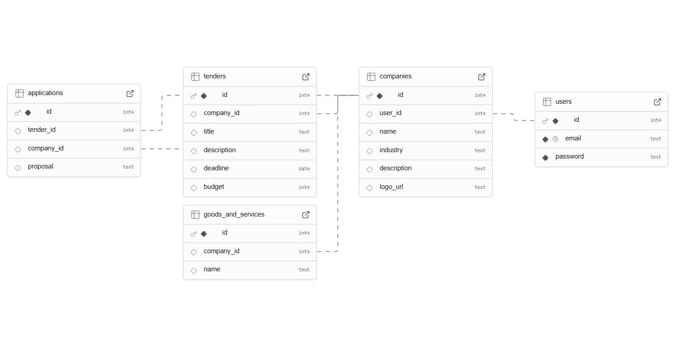

# B2B Tender Management Platform

A comprehensive tender management system that enables companies to register, create tenders, browse opportunities, and manage applications seamlessly.

## 🎯 Features

* **Company Management**: Register and manage company profiles with logo uploads
* **Tender Creation**: Create, publish, and manage tenders with detailed specifications
* **Application System**: Submit proposals and track application status
* **Search & Discovery**: Find companies by name, industry, or services offered
* **Authentication**: Secure JWT-based authentication system

## 📦 Tech Stack

* **Frontend**: Next.js + TypeScript + Tailwind CSS
* **Backend**: Node.js + Express.js + PostgreSQL (Supabase)
* **Authentication**: JWT (Token-based)
* **File Storage**: Supabase Storage (for company logos)
* **Validation**: Joi/Zod for input validation
* **Database**: PostgreSQL with migrations

## 📁 Project Structure

```
b2b-tender-platform/
├── backend/
│   ├── index.js
│   ├── db.js
│   ├── routes/
│   │   ├── auth.js
│   │   ├── company.js
│   │   ├── tender.js
│   │   └── application.js
│   ├── middleware/
│   │   └── auth.js
│   ├── migrations/
│   ├── .env            # ✅ ignored in .gitignore
│   ├── .env.example    # ✅ included
│   └── package.json
├── frontend/
│   ├── pages/
│   │   ├── dashboard/
│   │   ├── tenders/
│   │   └── companies/
│   ├── components/
│   ├── styles/
│   ├── utils/
│   ├── .env.local      # ✅ ignored in .gitignore
│   ├── .env.example    # ✅ included
│   └── package.json
├── .gitignore
├── README.md
├── er-diagram.png      # ✅ ER diagram image
├── schema.sql
├── architecture.md
└── docker-compose.yml (optional)
```

## 🚀 Getting Started

### Prerequisites

* Node.js (v18 or higher)
* PostgreSQL
* Supabase account

### 1. Clone the Repository

```bash
git clone https://github.com/your-username/b2b-tender-platform.git
cd b2b-tender-platform
```

### 2. Backend Setup

```bash
cd backend
cp .env.example .env
# Edit .env with your database credentials and JWT secret
npm install
npm run migrate  # Run database migrations
npm run dev
```

### 3. Frontend Setup

```bash
cd frontend
cp .env.example .env.local
# Edit .env.local with your API endpoints
npm install
npm run dev
```

### 4. Environment Variables

**Backend (.env):**

```env
DATABASE_URL=your_supabase_db_url
JWT_SECRET=your_jwt_secret
SUPABASE_URL=your_supabase_url
SUPABASE_ANON_KEY=your_supabase_anon_key
PORT=5000
```

**Frontend (.env.local):**

```env
NEXT_PUBLIC_API_URL=http://localhost:5000
NEXT_PUBLIC_SUPABASE_URL=your_supabase_url
NEXT_PUBLIC_SUPABASE_ANON_KEY=your_supabase_anon_key
```

## 🌐 Live Demo

* **Frontend**: [vercel-link](https://b2b-tender-platform-jb067esg0-umesh-rajus-projects.vercel.app)
* **Backend API**: [render-link](https://b2b-backend-q15a.onrender.com)

## 🏗️ Architecture Overview

### 🔐 Authentication Flow

1. User registers/logs in with email and password
2. JWT token is generated and sent to client
3. Token is stored in localStorage and sent via Authorization header
4. Protected routes use middleware to extract `req.user.id`

### 📦 API Design

#### 🔹 Authentication

* `POST /auth/register` → Register new user
* `POST /auth/login` → User login
* `POST /auth/logout` → User logout

#### 🔹 Companies

* `POST /company` → Create company profile
* `PUT /company` → Update company profile
* `GET /company` → Get current user's company
* `GET /companies` → Search companies (with filters)
* `GET /companies/:id` → Get company details
* `POST /company/logo` → Upload logo (Supabase Storage)

#### 🔹 Tenders

* `POST /tenders` → Create new tender
* `GET /tenders` → List all tenders (paginated)
* `GET /tenders/my` → Get current company's tenders
* `GET /tenders/:id` → Get tender details
* `PUT /tenders/:id` → Edit tender
* `DELETE /tenders/:id` → Delete tender

#### 🔹 Applications

* `POST /applications/:tenderId` → Apply to tender
* `GET /applications/:tenderId` → View applications for tender
* `GET /applications/my` → View user's applications
* `PUT /applications/:id` → Update application status

### ☁️ Supabase Storage Integration

* Company logos are uploaded to Supabase Storage buckets
* Images are processed using multer middleware
* Public URLs are stored in PostgreSQL database
* Secure file access with proper authentication

## 🗄️ Database Schema

The platform uses PostgreSQL with the following main tables:

* `users` - User authentication data
* `companies` - Company profiles and metadata
* `tenders` - Tender listings and specifications
* `applications` - Tender applications and proposals
* `services` - Company services/products for search

### 📊 Entity Relationship Diagram



## 🐳 Docker Support (Optional)

```bash
# Run with Docker Compose
docker compose up --build
```

## 📝 Development Notes

### Code Quality

* TypeScript for type safety
* Input validation using Joi/Zod
* Proper error handling with status codes
* Modular routing structure

### Security Features

* JWT-based authentication
* Input sanitization
* CORS configuration
* Environment variable protection

## 🤝 Contributing

1. Fork the repository
2. Create a feature branch (`git checkout -b feature/amazing-feature`)
3. Commit your changes (`git commit -m 'Add amazing feature'`)
4. Push to the branch (`git push origin feature/amazing-feature`)
5. Open a Pull Request

## 📄 License

This project is licensed under the MIT License.

## 📞 Contact

For questions or support, please reach out via [umeshraju82905@example.com](mailto:umeshraju82905@example.com)

---

**Note**: This is a demonstration project built for internship assignment purposes.
